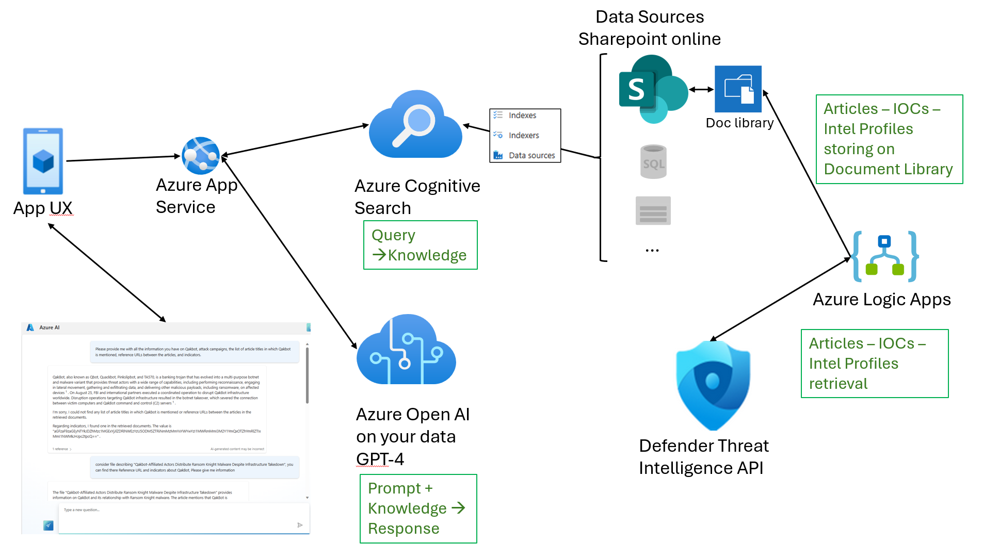
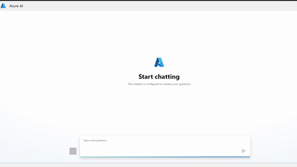

# Chat with your Cyber Threat Intelligence data with Azure OpenAI
Chat with your Cyber Threat Intelligence data with Azure OpenAI

Blog post: 

## Use case description.
The goal is to develop a chatbot using Azure OpenAI to engage in conversations with your intelligence data sourced from Microsoft Defender Threat Intelligence (MDTI). I've leveraged SharePoint Online as a document repository to programmatically and automatically ingest MDTI articles, indicators, and threat actor profiles. This automation harnesses MDTI APIs invoked by Azure Logic App.
By utilizing an Azure OpenAI instance and deploying a GPT-4 model, I've created a straightforward web application for conversing with the gathered threat intelligence data. Please note that this is a specific use case that involves the availability of MDTI (which can be enabled for trial, as described here). Alternatively, or to expand the use case, you can incorporate intelligence data from any source, such as OSINT, cybersecurity vendors, community sources, email data, national CERTs, and more.
The strength of Large Language Models (LLMs) lies in their proficiency with unstructured data and files in multiple formats. Particularly with Azure OpenAI, you can be assured of secure data management, ensuring that data is not shared with any external parties and aligning with privacy regulations and international standards

To upload this playbook in Azure please follow the below instructions:
- From the Azure portal menu, in the search box, type Template, and then select Templates
- Select +Add and give it a Name and Description
- copy and paste the json file in the previous folder in the ARM template layout.
- click add
- your logic app is created and ready to be deployed

# Chatbot:

# Demo:

## Microsoft Defender Threat Intelligence articles and IOCs retrieval
It has a 'Recurrence' type time trigger set up daily. The parameters for the App Registration are defined: Tenant ID, Client ID, and Secret (I recommend not storing this information within the playbook for scenarios beyond testing but using Azure Key Vault).
The playbook initiates a GET request to obtain the list of articles within the specified time range. Subsequently, within a 'For Each' loop, for each article's ID, a GET request is made to retrieve all information about the article itself. A similar call is made to obtain the list of IOCs (Indicators of Compromise).
The penultimate step involves constructing a single JSON file containing the article's content and the list of indicators (I implemented this step for user convenience to have the information in a single file). Finally, the last step includes creating a JSON file with the output information, which is then written to the document library of the previously defined SharePoint Online site.

## Microsoft Defender Threat Intelligence Intel Profiles retrieval
The second playbook - MDTI_Get_Intel_Profile_to_SPO - is responsible for retrieving information about Threat Profiles and writing them to a JSON file within the same document library used previously. The trigger is still time-based, set to run daily. App Registration parameters are defined: Tenant ID, Client ID, and Secret (I recommend not storing this information within the playbook for scenarios beyond testing but using Azure Key Vault).
The playbook initiates a GET request to obtain the list of Intel Profile IDs, which are subsequently used in a 'For Each' loop to make another GET request to retrieve all the Intel Profiles. This information is then written to a JSON file in SharePoint Online.

## Contributing

Contributions are always welcome!